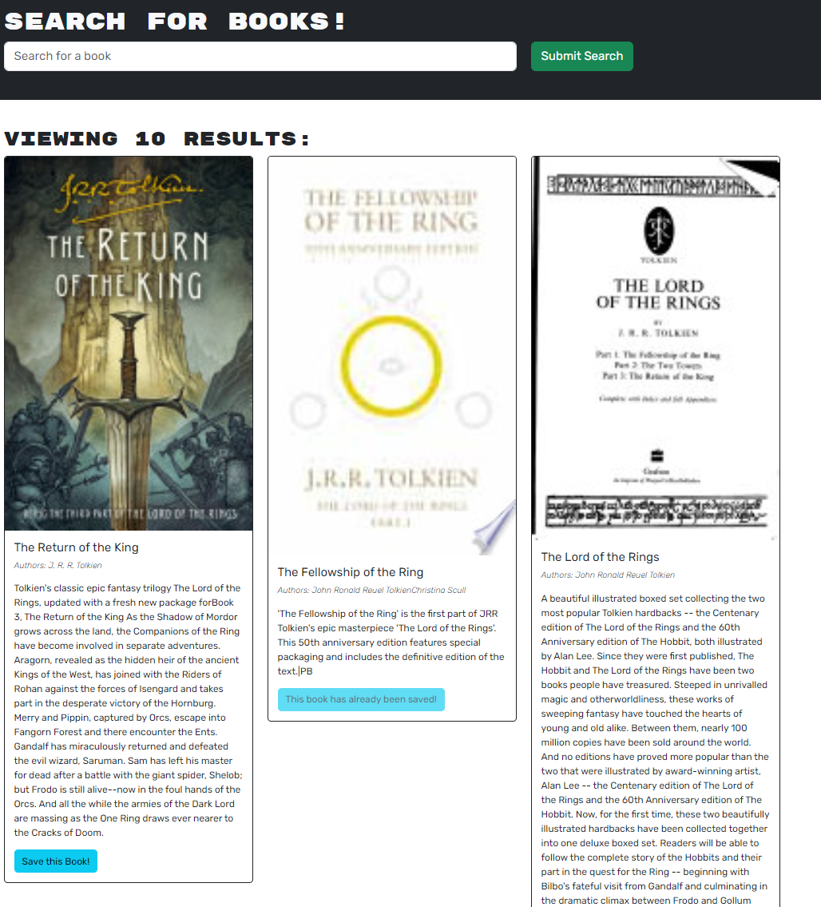

# MERN Stack - Book Search Engine

## Description

In this project I used provided starter code for a Google Books API search engine that was set-up using RESTful API, and I've rebuild it to use Apollo server and GraphQL API instead.

This application is build using React front, MongoDB, Node/Express server and APIs. It provides the user with functionality to create a new accoun, search for books, and to save/remove books to their account.

In my task of refactoring the code I did the following:

- Setup the Appollo server, built GraphQL queries and mutations to fetch and modify data.
- Setup Apollo provider to communicate requests with the server.
- Refactored authentication middleware to work with GraphQL.

The application is deployed to Heroku and uses MongoDB Atlas.

[Link to working application](https://leccinum-scabrum-321b7a9aec9b.herokuapp.com/)

[](https://opensource.org/licenses/Apache-2.0)

## Table of Contents

- [Product Demonstration](#product-demonstration)
- [Installation](#installation)
- [Usage](#usage)
- [Technologies Used](#technologies-used)
- [Contributing](#contributing)
- [Tests](#tests)
- [Questions](#questions)
- [License](#license)

## Product Demonstration



## Installation

Clone the repository or download/unzip the archive file. To install required dependencies use CLI to run:

```
npm i
```

## Usage

Use the below commands to run the application on http://localhost:3000 once the dependencies have been installed:

```
npm run build
```

```
npm run develop
```

## Technologies Used

- HTML
- CSS
- Bootstrap
- React
- Javascript
- Node.js
- Express.js
- Apollo-server-express
- GraphQL
- MongoDB/Mongoose
- jsonwebtoken
- bcrypt

## Contributing

If you would like to contribute to this project please use the contact details below.

## Tests

N/A

## Questions

Any questions regarding this project can be directed to:

- Email: [tp4458@gmail.com](tp4458@gmail.com)
- GitHub [TP4458](https://github.com/TP4458)

## License

This product is licensed with Apache 2.0 License. Please click on the badge below, or at the top of this document to find out more.

[](https://opensource.org/licenses/Apache-2.0)
